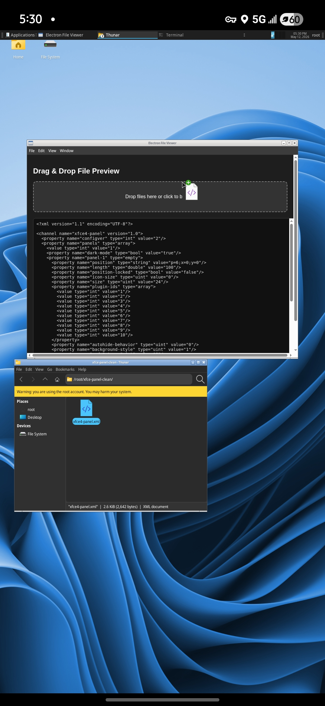

# DropView
A fast file drag and drop preview build with Electron.

# DropView is a lightweight, cross-platform desktop application that let's you drag and drop files to instantly preview them. 
It's designed to be fast, simple, and useful - no clutter, no extra steps. 

DropView aims to become a universal viewer for common file types, giving users a quick way to inspect content without opening heavy applications. 

# Features. 
Drag-and-drop file preview
Image preview (PNG, JPG, GIF, BMP, WebP) 
Text preview (TXT, MD, JSON, JS, HTML, CSS, ect.) 
PDF preview (planned)
File Metadata display
Clean, minimal UI
Cross-platform support (Windows, Linux, macOS via Github Actions)

# Installation. 
DropView installers will be avaliable on the Releases page once first build is published.

Planned release formats:
Windows:.exe
Linux:.AppImage,.deb
macOS:.dmg

# Development Setup. 

Clone the repository:
git clone https://github.com/JAY-hub-design/DropView.git
cd DropView

# Install dependencies. 
npm install

# Run the app in development mode. 
npm start

# Build installers. 
(after electron-builder is configured):
npm run build

# Project structure. 
DropView/
│
├── src/
│   ├── main.js        # Electron main process
│   ├── renderer.js    # UI logic + drag/drop handling
│   ├── index.html     # App UI
│   └── styles.css     # App styling
│
├── package.json
├── .gitignore
├── LICENSE
└── README.md

## Screenshots

### Main Window

The main window shows:
- The drag‑and‑drop file zone  
- Automatic file preview  
- Syntax‑highlighted text/XML rendering

## Roadmap

- [ ] PDF preview support  
- [ ] Syntax highlighting for more file types  
- [ ] Dark/Light theme toggle  
- [ ] File metadata sidebar  
- [ ] Recent files list  
- [ ] Settings panel  
- [ ] Auto‑update support  
- [ ] Cross‑platform installers (Windows, Linux, macOS)

## Contributing

Contributions are welcome!

If you’d like to help improve DropView:

1. Fork the repository  
2. Create a new branch  
3. Commit your changes  
4. Open a pull request  

Please keep code clean and follow the existing project structure.

## License

This project is licensed under the MIT License.  
See the LICENSE file for details.

## Author

DropView is developed by Jared.  
If you find this project useful, consider starring the repository!
